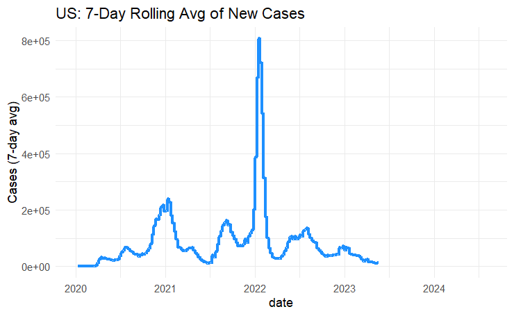

# COVID-19 R and SQL Analysis Project

## 🔍 Overview
This project presents a comprehensive exploratory and statistical analysis of global COVID-19 data using R. The goal is to showcase advanced data wrangling, visualization, and statistical testing skills that are directly relevant to data analyst roles.

Data is sourced from [Our World in Data (OWID)](https://docs.owid.io/projects/covid/en/latest/), covering over 200 countries with detailed metrics on COVID-19 cases, deaths, testing, vaccinations, policy response, and population demographics.

---

## 🎯 Objectives
- Ingest and clean real-world COVID-19 data
- Conduct time-series and comparative visual analysis
- Apply statistical tests to identify meaningful patterns
- Present insights clearly for decision-making or public health communication

---

## 🧰 Tools Used
- **R** / **RStudio** for analysis and visualization
- **tidyverse** for data wrangling
- **ggplot2** and **plotly** for visualizations
- **zoo** for moving averages
- **Kendall** for nonparametric trend testing
- **GitHub** for version control and portfolio presentation

---

## 📂 Project Structure
```
covid19-r-analysis/
├── script.r              # Full R analysis script
├── queries.sql           # Supporting SQL queries for MySQL ingestion
├── figures/              # Output plots used in README
├── README.md             # This file
```

---

## 📊 Key Analyses
### ✅ Time Series Trends
- Daily new cases and deaths in the US
- 7-day moving average smoothing
- Multi-country trend comparisons

### 📈 Policy Response vs. Case Rates
- Policy stringency index compared to new case trajectories
- Vaccination rates by country and their effect

### 📉 Statistical Testing
- **T-test** comparing US and Germany case rates
- **Mann-Kendall test** for monotonic trend detection in US cases
- **Pearson correlation** between policy stringency and case rate in the US

### 📊 Summary Metrics
- Top 10 countries by total cases
- Case fatality rates plotted in log–log scale
- Fully vaccinated population by country

---

## 📷 Example Visualizations

### US 7-Day Rolling Average of Cases
[](figures/635db6a0-066b-45e8-9c29-31bcb0e36ef5.png)


---

## 🚀 How to Run
1. Clone the repository:
```bash
git clone https://github.com/tylermaire/covid19-r-analysis.git
```
2. Open `script.r` in RStudio
3. Install packages:
```r
install.packages(c("tidyverse", "lubridate", "plotly", "zoo", "Kendall"))
```
4. Make sure `owid-covid-data.csv` is in the project root
5. Run the script to generate all visuals and results

---

## 📌 Why This Project Matters
This project shows proficiency in:
- Cleaning and joining real-world datasets
- Extracting insights through visual analysis
- Using statistical methods for validation
- Presenting findings in a reproducible, portfolio-ready format

Whether applying for a role in healthcare analytics, public policy, or data-driven business roles, this project reflects the analytical mindset and technical ability of a professional data analyst.

---

## 📎 Data Source
- [Our World in Data COVID-19 Dataset](https://github.com/owid/covid-19-data)
- License: [CC BY 4.0](https://creativecommons.org/licenses/by/4.0/)

---

## 👨‍🔬 Author
**Tyler Maire**  
Bioinformatics & Data Analytics  
University of Florida Entomology Department  
GitHub: [@tylermaire](https://github.com/tylermaire)

---

## 📈 Future Improvements
- Add Shiny dashboard for interactivity
- Expand to US state-level analysis
- Apply predictive modeling or clustering for trend detection

---
Thanks for visiting! ⭐ If you like this project, consider starring or sharing it!


